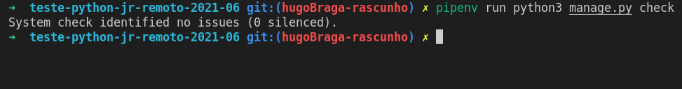
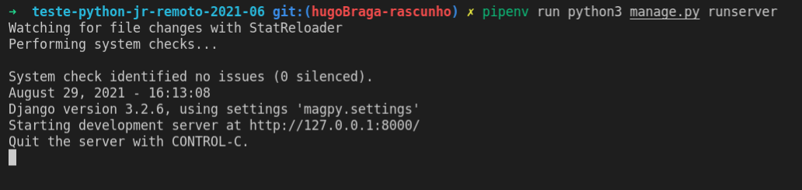

# Como instalar / How to install

### Oque voce precisa? / What you need?

* python_version >= "3.9"

  * Verifique usando o comando / Check in "`$ python3 --version`"
  * [Instale usando esse guia / Install using this guide](https://www.python.org/downloads/)
  * https://www.psycopg.org/install/
  * No linux
  * ```bash
    sudo apt install python3-dev libpq-dev
    ```
* pipenv

  * Verifique usando o comando / Check in "`$ pipenv  --version`"
  * [Instale usando esse guia / Install using this guide](https://pipenv.pypa.io/en/latest/#install-pipenv-today)

### Instalando a base / Install the base:

* rode o comando: / run the command:
  * "`git clone https://github.com/Hugobrr/teste-python-jr-remoto-2021-06.git`
  * Para copiar o repositorio:
  * `pipenv install`
  * Para instalar o repositorio:
  * Para checar / For check:
    * `pipenv run python3 manage.py help`
    * `pipenv run python3 manage.py check`
    * Especte this response:
    * "System check identified no issues (0 silenced)."



# Como rodar? Who to run?

`pipenv run python3 manage.py makemigrations`

`pipenv run python3 manage.py migrate`

`pipenv run python3 manage.py runserver`



# Oque ele deve fazer?

### Python e pypi

Com as linguagens de progamação modernas é comun que se tenha um genenciador biblioteca de dependencias. No Python a mais famosa é PyPI ou pip no Javascrepit temos o Node ou Npm.

### Oque fazemos

Garantir que a dependencia na versão certa para esse problema surge essa aplicação.

Nela o usuario coloca um nome para o projeto e quais pacotes e versões usadas, se ele não colocar versão sera escolhiada a padrão do projeto. Caso versão ou nome do pacote não esteja no repositorio será voltado um erro.

# Como usar?

### Cadastrar Projeto

Tendo o nome do projeto nesse caso vamos chamar de "" Alem disso temos que que saber os pacotes versões se quiser cadastrar vamos usar esse exemplo, como usamos o JSON podemos usar esse montador em de JSON

### Ver todos os projetos

Para ver basta ir na rota e o resultado vai ser parecido:

### Ver um projeto especifico

Para ver um projeto especifico basta colocar o nome dele na rota e o resultado vai ser assim:

### Deletar um projeto

Para deletar basta mandar o HTML:

# Como testar?

### Teste com o K6

Para um teste externo use o k6, caos não tenha instalado pode instalar nesse [link](https://k6.io/docs/getting-started/installation/https:/):

```bash
k6 run -e API_BASE='https://rascunho.herokuapp.com/' tests-open.js
```

```bash
k6 run -e API_BASE='http://localhost:8000/' tests-open.js
```

### Teste com o Django

Rode esse comando:

```bash
pipenv run python3 manage.py test
```

O resultado deve ser como esse:

### Teste com o SWAGGER (ALFA)

Basta navegar até a rota /

[Local](https://localhost:8000/)

[Heroko](http://rascunho.herokuapp.com)

# Quais os proximos passos?

* [ ] Fazer o conteiner para rodar esse bloco
* [X] Checar a documentação para ver as regras de nome de pacote PyPI
* [X] Criar função para checar nome PyPI
* [X] Checar a documentação para ver as regras para versões dos pacotes PyPI
* [X] Criar função para checar versões PyPI
* [ ] Tirar as rotas não estabelecidas (PUT, PATCH)
* [ ] Melhorar o texto do SWAGGER
* [ ] Terminar de traduzir esse README

### Documentação sobre os nomes:

https://docs.python.org/dev/library/unicodedata.html#module-unicodedata
https://www.python.org/dev/peps/pep-3131/#id12
https://www.python.org/dev/peps/pep-3131/
https://www.python.org/dev/peps/pep-0423/#use-a-single-name

https://docs.djangoproject.com/en/3.2/topics/security/

[Documentação sobre as regras de nome em Python](https://www.python.org/dev/peps/pep-3131/#id16)

Regra para o primeiro caracter:

> ID_Start is defined as all characters having one of the general categories uppercase letters (Lu), lowercase letters (Ll), titlecase letters (Lt), modifier letters (Lm), other letters (Lo), letter numbers (Nl), the underscore, and characters carrying the Other_ID_Start property. XID_Start then closes this set under normalization, by removing all characters whose NFKC normalization is not of the form ID_Start ID_Continue* anymore.The exact specification of what characters have the XID_Start or XID_Continue properties can be found in the DerivedCoreProperties file of the Unicode data in use by Python (4.1 at the time this PEP was written), see [[6]](https://www.python.org/dev/peps/pep-3131/#id12). For reference, the construction rules for these sets are given below. The XID_* properties are derived from ID_Start/ID_Continue, which are derived themselves

Regras para os demais caracteres:

> ID_Continue is defined as all characters in ID_Start, plus nonspacing marks (Mn), spacing combining marks (Mc), decimal number (Nd), connector punctuations (Pc), and characters carrying the Other_ID_Continue property. Again, XID_Continue closes this set under NFKC-normalization; it also adds U+00B7 to support Catalan.

Podemos extrair desses paragrafos a seguinte lista de regras Unicode:

### Pensando de forma analitica temos:

##### Para o primeiro caracter

* uppercase letters (Lu),
* lowercase letters (Ll),
* titlecase letters (Lt),
* modifier letters (Lm),
* other letters (Lo),
* letter numbers (Nl),
* the underscore "_",
* characters carrying the Other_ID_Start property.

##### E para os demais caracter

* plus nonspacing marks (Mn),
* spacing combining marks (Mc),
* decimal number (Nd),
* connector punctuations (Pc),
* U+00B7 '·',

Nisso podemos elaborar esse codigo:

```python
STARTER_LIST = ["Lu", "Ll", "Lt", "Lm", "Lo", "Nl"]

CONTINUE_LIST = ["Mn", "Mc", "Nd", "Pc", "Lu", "Ll", "Lt", "Lm", "Lo", "Nl"]

from unicodedata import category

if category(name[0]) in starter_list or name[0] == '_' :
    for letter in name[1:]:
         if category(letter) in not continue_list and letter != '·' :
               reise XABLAU #TODO
else:
    reise XABLAU #TODO
```

### Documentação para a versão

Existe uma versão de regex que pega os caso canonicos porem ele só passa 98.12% das versões.

Devido a isso eu fiz um regex que pegaria teoricamente todas os tipos de verções disponiveis.

[Documentação de base para o meu Regex](https://www.python.org/dev/peps/pep-0440/#id24https:/)

[Fonte do Regex](https://www.python.org/dev/peps/pep-0440/#id81https:/)

### Regex canonico

```python
import re
def is_canonical(version):
return re.match(r'^([1-9][0-9]*!)?(0|[1-9][0-9]*)(\.(0|[1-9][0-9]*))*((a|b|rc)(0|[1-9][0-9]*))?(\.post(0|[1-9][0-9]*))?(\.dev(0|[1-9][0-9]*))?$', version) is not None
```

### Regex que eu fiz:

```python
import re
def is_valid(version):
return re.match(r'(\d.)*(a|b|c|post|!|\+|dev|\.)*\d', version) is not None
```

[Você pode ver mais sobre o regex que eu fiz aqui](https://regex101.com/r/5WLamu/1)

return re.match(r'(\d.)*(a|b|c|post|!|\+|dev|\.)*\d', version) is not None

# Para lhe ajudar a criar um JSON

[Llink para o criador de JSON](http://www.objgen.com/json/models/TRu)

`"I decise use a MVC arqueiteture and I truste in Models departem of Data banck as crieat This API only acept projetc name usen regular character without banckspace because this name is pasd whti paramete in get requisiton"`
